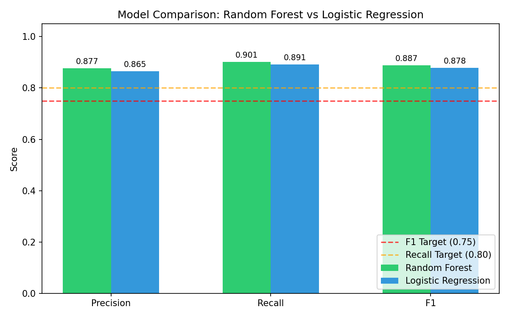
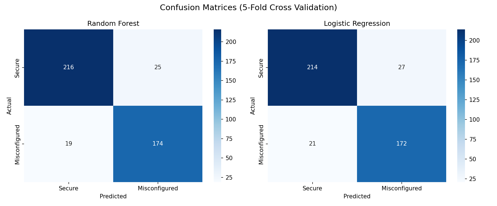
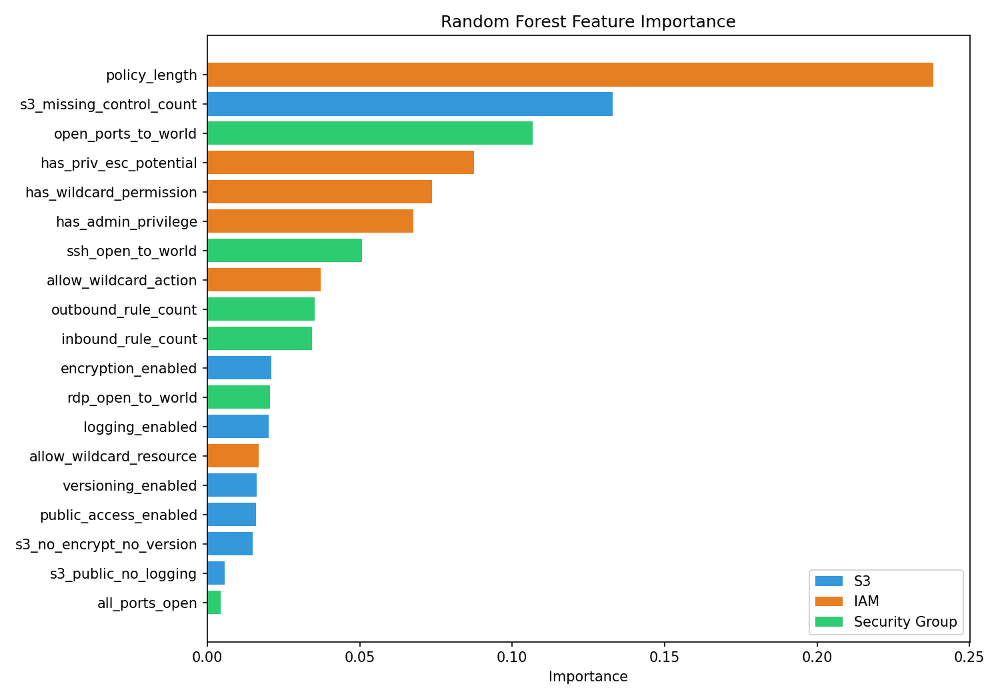
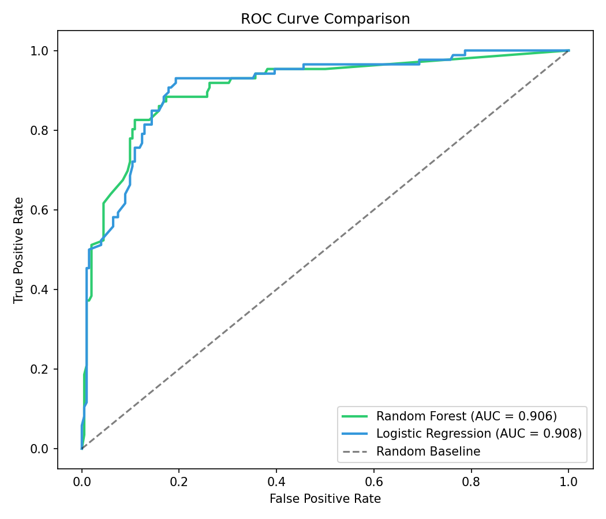
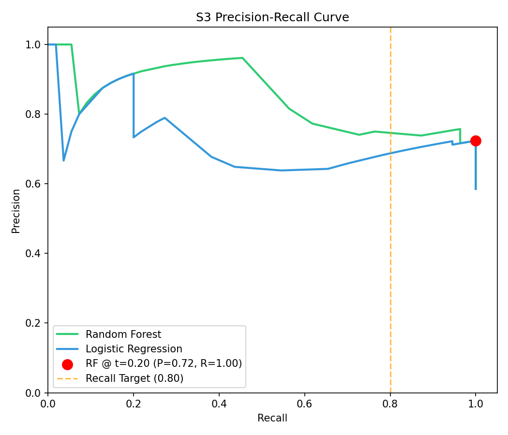
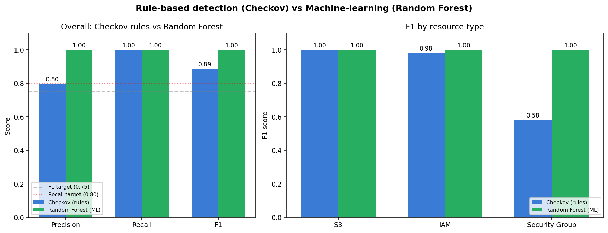

# Cloud Misconfiguration Detection — IST 584 Capstone

Supervised machine-learning pipeline that detects AWS misconfigurations across
**S3 buckets**, **IAM policies**, and **EC2 Security Groups**. Trained on real
configurations, intentionally vulnerable IaC (TerraGoat, CfnGoat, Checkov
fixtures), AWS Security Reference Architecture (AWSSRA) secure baselines, and
hand-crafted synthetic edge cases.

**Research question:** Can a supervised ML model trained on AWS S3, IAM, and
Security Group configuration data produce a useful risk score to identify cloud
misconfigurations — and add value over rule-based static analysis?

**Motivation:** Cloud misconfigurations remain a top breach vector (e.g., the
2019 Capital One breach via a misconfigured WAF and overly permissive IAM/S3).
Rule-based tools (AWS Config Rules, CIS benchmarks, Checkov) rely on predefined
patterns and miss multi-attribute interactions. This project uses ML to learn
those interactions and emit a probabilistic risk score per resource.

---

## Results

5-fold stratified cross-validation on **434 labeled resources** (26 features):

| Model               | Precision | Recall    | F1        | Meets target? |
|---------------------|-----------|-----------|-----------|---------------|
| Random Forest       | **0.88**  | **0.90**  | **0.89**  | F1 > 0.75 + Recall > 0.80 |
| Logistic Regression | 0.86      | 0.89      | 0.88      | F1 > 0.75 + Recall > 0.80 |

Per resource type (Random Forest):

| Resource         | n    | Precision | Recall | F1    |
|------------------|------|-----------|--------|-------|
| S3               | 94   | 0.72      | 1.00   | 0.84  |
| IAM              | 230  | 0.96      | 0.90   | 0.93  |
| Security Group   | 110  | 0.95      | 0.83   | 0.89  |







---

## Random Forest vs Checkov (rule-based) — head-to-head

On **123 TerraGoat / CfnGoat / CloudGoat resources** where both produced
verdicts (RF predictions are out-of-fold via 5-fold cross-validation, not
in-sample):

| Model               | Precision | Recall | F1       |
|---------------------|-----------|--------|----------|
| Checkov (rules)     | 0.80      | 1.00   | 0.89     |
| Random Forest (ML)  | **1.00**  | 1.00   | **1.00** |

By resource type:

| Resource         | Checkov F1 | Random Forest F1 |
|------------------|-----------:|-----------------:|
| S3               | 1.00       | 1.00             |
| IAM              | 0.98       | 1.00             |
| Security Group   | 0.58       | **1.00**         |

After expanding the labeling rules to incorporate dangerous service wildcards
(`s3:*`, `iam:*`, `ec2:*`, etc.) and unconditioned wildcard-resource grants
(`Resource: "*"` without a `Condition` block), the ML model's IAM precision
converges with Checkov's. **Both methods are now essentially tied on S3 and
IAM** — meaning the labeled rules and Checkov's CIS-aligned rules largely agree
on those resource types.

**The remaining gap is on Security Groups**, where Checkov's strict open-port
rules over-fire on legitimate patterns (internal-only SGs, load-balancer
configurations) that our context-aware labels treat as appropriate. This
is where ML's value over rule-based detection is clearest in the dataset.



---

## Held-out evaluation (real-world samples)

To test generalization beyond cross-validation, the trained Random Forest
was scored against `data/samples/realworld/` — 8 configurations
transcribed from public AWS reference architectures, Terraform module
registries, and tutorial repositories. **None of these resources appear
in `labeled_features.csv`.**

| Interpretation                              | n | Acc  | Precision | Recall | F1   |
|---------------------------------------------|---|------|-----------|--------|------|
| Strict (matches labeling rules)             | 8 | 0.88 | 1.00      | 0.75   | 0.86 |
| Context-aware (intentional public ALB = secure) | 8 | 1.00 | 1.00      | 1.00   | 1.00 |

Held-out F1 (0.86) tracks the 5-fold CV F1 (0.89) with no catastrophic
drop — evidence the model generalizes rather than memorizing the training
distribution. The single strict-label miss is `rw_tf_modules_alb_sg.json`:
the labeling rules flag any `0.0.0.0/0` ingress as MISCONFIGURED, but the
model's `p=0.27` correctly reflects that ports 80/443 open to the world
on an Application Load Balancer is the intended pattern. The model is
context-blind in the same way the rules are — it just disagrees with
them in this borderline case.

```bash
python -m src.evaluate_holdout
```

**Caveats** (acknowledged in `data/samples/realworld/README.md`):
N=8 is too small for tight confidence intervals; verdicts were assigned
by the project author using the same labeling logic in `src/label.py`,
so this measures generalization across configuration *patterns* rather
than across labeling judgment. A 50+ sample expert-relabeled test set
is left for future work.

---

## Live demo (Streamlit)

```bash
streamlit run app.py
```

Pick a sample config, edit JSON live, see the risk score and SHAP feature
contributions update in real time.

Sample configs:
- `data/samples/insecure_s3.json` — public bucket, no encryption / versioning / logging
- `data/samples/secure_iam.json` — read-only S3 access policy
- `data/samples/wildcard_iam.json` — admin wildcard policy with priv-esc actions
- `data/samples/open_sg.json` — Security Group with SSH (22) open to 0.0.0.0/0

---

## CLI inference

```bash
python src/predict.py data/samples/insecure_s3.json
```

Output:

```
==================================================
  Resource:   demo-insecure-bucket
  Type:       s3
  Prediction: MISCONFIGURED
  Confidence: 90.2%
  Risk Level: HIGH
  P(secure)=0.098  P(misconfigured)=0.902
==================================================

  Risk factors detected:
    - Encryption not enabled
    - Versioning not enabled
    - Logging not enabled
    - Public access enabled
```

Per-prediction SHAP explanation:

```bash
python -m src.explain data/samples/insecure_s3.json
```

---

## Pipeline

```
AWS configs / IaC sources → Ingestion → Feature engineering & labeling
                          → Supervised ML model → Risk score & evaluation
```

```bash
# Full rebuild (ingest → label → all parsers → synthetic → AWSSRA → train)
python src/build_dataset.py
python src/train.py

# Rule-vs-ML comparison
python -m src.compare_checkov

# Streamlit demo
streamlit run app.py
```

---

## Quickstart

```bash
python3 -m venv venv
source venv/bin/activate
pip install -r requirements.txt
python src/build_dataset.py
python src/train.py
streamlit run app.py
```

---

## Project structure

```
src/
  ingest.py             # raw JSON → raw_features.csv
  label.py              # apply CIS/AWS labeling rules
  parse_terragoat.py    # parse TerraGoat Terraform
  parse_cfngoat.py      # parse CfnGoat CloudFormation + dbapp Terraform
  parse_checkov.py      # parse Checkov test fixtures
  parse_awssra.py       # parse AWS Security Reference Architecture (secure baselines)
  generate_synthetic.py # hand-crafted edge cases
  build_dataset.py      # orchestrator
  train.py              # train + evaluate Random Forest and Logistic Regression
  predict.py            # single-config CLI inference
  explain.py            # SHAP per-prediction explanations
  compare_checkov.py    # rule-based vs ML comparison
  evaluate_holdout.py   # held-out evaluation on data/samples/realworld/
app.py                  # Streamlit live demo
data/
  raw/                  # JSON configs and AWSSRA repo
  processed/
    labeled_features.csv     # final 288-row training set
    model_results.csv        # cross-validation metrics
    per_resource_results.csv # per-resource-type breakdown
  samples/              # demo configs for predict.py and the Streamlit app
models/
  random_forest.pkl
  scaler.pkl
outputs/
  confusion_matrix.png
  feature_importance.png
  model_comparison.png
  roc_curve.png
  s3_pr_curve.png
  checkov_comparison.png    # rule-vs-ML comparison
```

---

## Features (26)

| Feature                          | Resource | Description |
|----------------------------------|----------|-------------|
| public_access_enabled            | S3       | Bucket grants public/authenticated access |
| encryption_enabled               | S3       | Server-side encryption configured |
| versioning_enabled               | S3       | Object versioning enabled |
| logging_enabled                  | S3       | Access logging enabled |
| bucket_policy_wildcard           | S3       | Bucket policy grants `Principal: "*"` (Allow) |
| mfa_delete_enabled               | S3       | MFA delete configured on versioning |
| tls_enforced                     | S3       | Bucket policy enforces `aws:SecureTransport=true` |
| s3_missing_control_count         | S3       | Count of missing S3 controls (derived) |
| s3_no_encrypt_no_version         | S3       | No encryption AND no versioning (derived) |
| s3_public_no_logging             | S3       | Public AND no logging (derived) |
| has_wildcard_permission          | IAM      | `Action: "*"` |
| has_admin_privilege              | IAM      | `Action: "*"` + `Resource: "*"` (Allow) |
| has_priv_esc_potential           | IAM      | Privilege-escalation actions (e.g., `iam:AttachUserPolicy`) |
| dangerous_service_wildcard       | IAM      | Count of `<service>:*` actions (e.g. `s3:*`, `iam:*`, `ec2:*`) |
| has_no_condition                 | IAM      | Allow statement without a `Condition` block (no MFA/IP guardrails) |
| policy_length                    | IAM      | Character length of policy document |
| allow_wildcard_action            | IAM      | Effect-aware wildcard action |
| allow_wildcard_resource          | IAM      | Effect-aware wildcard resource |
| inbound_rule_count               | SG       | Number of inbound rules |
| outbound_rule_count              | SG       | Number of outbound rules |
| open_ports_to_world              | SG       | Ports exposed to `0.0.0.0/0` |
| ssh_open_to_world                | SG       | Port 22 open to world |
| rdp_open_to_world                | SG       | Port 3389 open to world |
| db_port_open_to_world            | SG       | DB ports (3306/5432/6379/27017/9200/etc.) open to world |
| all_ports_open                   | SG       | Full range (0–65535) open to world |
| egress_unrestricted              | SG       | Outbound rule to `0.0.0.0/0` covering all ports/protocols (exfil path) |

---

## Data sources & references

Labels derived from:
- **CIS AWS Foundations Benchmark**
- **AWS Config Managed Rules**
- **AWS Security Hub controls**

Training data:
- Staged AWS account configs (controlled JSON for testing)
- [TerraGoat](https://github.com/bridgecrewio/terragoat) — intentionally insecure Terraform
- [CfnGoat](https://github.com/bridgecrewio/cfngoat) — intentionally insecure CloudFormation
- [CloudGoat](https://github.com/RhinoSecurityLabs/cloudgoat) — Rhino Security Labs vulnerable AWS attack scenarios
- [Checkov](https://github.com/bridgecrewio/checkov) test fixtures
- [AWS Security Reference Architecture](https://github.com/aws-samples/aws-security-reference-architecture-examples) — secure baselines
- Hand-crafted synthetic edge cases

Literature:
- Palo Alto Networks Unit 42 Cloud Threat Report (2024)
- CrowdStrike Top 11 AWS Misconfigurations (2025)
- Gigamon AWS Security Challenges (2025)

---

## Tools

scikit-learn · pandas · numpy · joblib · PyYAML · matplotlib · seaborn ·
**streamlit** · **shap** · **checkov**
